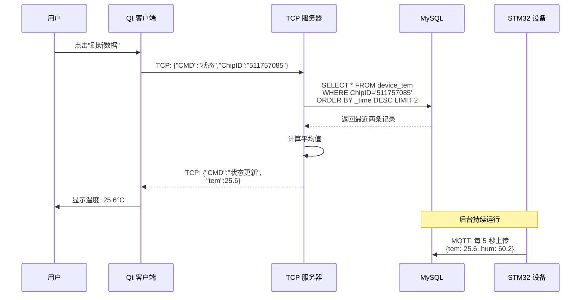
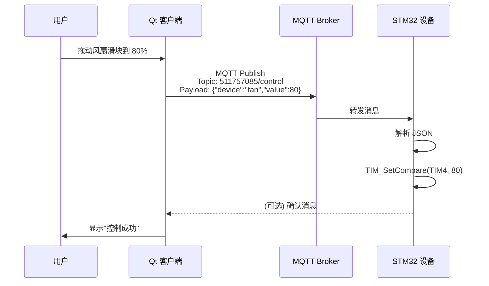

# 📊 系统架构与数据流详解

本文档详细说明 IoT 智能环境监控系统的架构设计、数据流向和各模块交互方式。

## 🏗️ 整体架构

```
┌─────────────────────────────────────────────────────────────────────┐
│                         云端服务器层                                  │
│                    (Linux/macOS Cloud Server)                        │
├──────────────────────────┬──────────────────────────────────────────┤
│                          │                                           │
│  ┌───────────────────┐   │   ┌─────────────────────────────┐        │
│  │  TCP 服务器        │   │   │  MQTT 服务器                 │        │
│  │  (Boost.Asio)     │   │   │  (Paho MQTT C)              │        │
│  │                   │   │   │                              │        │
│  │ • 用户认证        │   │   │ • 订阅设备主题                │        │
│  │ • 设备绑定管理    │◄──┼──►│ • 接收传感器数据              │        │
│  │ • 数据查询接口    │   │   │ • JSON 解析                  │        │
│  │ • Port: 10000    │   │   │ • 数据写入 MySQL              │        │
│  └────────┬──────────┘   │   └──────────┬──────────────────┘        │
│           │              │              │                            │
│           └──────────────┼──────────────┘                            │
│                          │                                           │
│                  ┌───────▼────────┐                                  │
│                  │  MySQL 数据库   │                                  │
│                  │                │                                  │
│                  │ • 用户表       │                                  │
│                  │ • 设备绑定表   │                                  │
│                  │ • 传感器数据表 │                                  │
│                  └────────────────┘                                  │
└──────────────────────────┬──────────────────────────────────────────┘
                           │
              ┌────────────┴────────────┐
              │                         │
     ┌────────▼────────┐      ┌────────▼────────┐
     │   上位机客户端    │      │   下位机设备     │
     │   (Qt 5.9.9)    │      │  (STM32+ESP8266) │
     │                 │      │                  │
     │ • TCP 连接服务器 │      │ • WiFi 连接      │
     │ • MQTT 控制设备  │      │ • MQTT 通信      │
     │ • 数据可视化     │      │ • 传感器采集     │
     │ • 语音识别       │      │ • 执行器控制     │
     │ • 天气查询       │      │ • OLED 显示      │
     └─────────────────┘      └──────────────────┘
```

## 📡 通信协议详解

### 1. TCP 通信（上位机 ↔ 服务器）

**用途**: 用户管理、设备绑定、数据查询

**连接流程**:
```
Qt 客户端                    TCP 服务器
    │                           │
    │──── SYN ─────────────────▶│  建立连接
    │◀──── SYN+ACK ────────────│
    │──── ACK ─────────────────▶│
    │                           │
    │──── JSON 请求 ───────────▶│  发送命令
    │◀──── JSON 响应 ──────────│  返回结果
    │                           │
    │──── FIN ─────────────────▶│  断开连接
    │◀──── ACK ────────────────│
```

**JSON 消息格式**:

*请求示例 - 用户注册*:
```json
{
  "CMD": "注册",
  "ID": "user001",
  "pass": "encrypted_password",
  "name": "张三",
  "email": "zhang@example.com"
}
```

*响应示例*:
```json
{
  "CMD": "注册结果",
  "State": true
}
```

**支持的操作**:

| 操作 | CMD 字段 | 说明 |
|------|---------|------|
| 注册 | `"注册"` | 创建新用户账户 |
| 登录 | `"登录"` | 验证用户身份 |
| 绑定设备 | `"绑定"` | 将设备关联到用户 |
| 获取绑定列表 | `"获取绑定"` | 查询用户的所有设备 |
| 查询状态 | `"状态"` | 获取设备实时数据 |

### 2. MQTT 通信（下位机 ↔ 服务器）

**用途**: 实时数据传输、设备控制

**主题命名规则**:
- **上传主题**: `{ChipID}` （设备 → 服务器）
- **控制主题**: `{ChipID}/control` （服务器 → 设备）

**QoS 级别**: 
- QoS 0: 最多一次（传感器数据）
- QoS 1: 至少一次（控制指令）

**数据上传流程**:
```
STM32 设备              MQTT Broker          MQTT 服务器
    │                       │                     │
    │── CONNECT ───────────▶│                     │
    │◀─ CONNACK ───────────│                     │
    │                       │                     │
    │── PUBLISH ───────────▶│                     │
    │   Topic: 511757085   │                     │
    │   Payload: JSON      │                     │
    │                       │── PUBLISH ─────────▶│
    │                       │   (转发消息)         │
    │                       │                     │── 解析 JSON
    │                       │                     │── 写入 MySQL
    │                       │                     │
    │◀─ PUBACK ────────────│                     │
```

**控制下发流程**:
```
Qt 客户端              MQTT Broker          STM32 设备
    │                       │                     │
    │── PUBLISH ───────────▶│                     │
    │   Topic: 511757085/  │                     │
    │          control     │                     │
    │   Payload: JSON      │                     │
    │                       │── PUBLISH ─────────▶│
    │                       │   (转发消息)         │
    │                       │                     │── 解析 JSON
    │                       │                     │── 执行控制
    │                       │                     │
    │                       │◀─ PUBACK ───────────│
```

**JSON 数据格式**:

*传感器数据上传*:
```json
{
  "ChipID": "511757085",
  "tem": 25.6,
  "hum": 60.2,
  "light": 1024,
  "beep": 0,
  "fan": 50,
  "led3": 1
}
```

*控制指令下发*:
```json
{
  "CMD": "control",
  "device": "fan",
  "value": 80
}
```

## 💾 数据库设计

### ER 图

```
┌──────────────┐       ┌──────────────────┐
│    user      │1────M│   user_chip      │
├──────────────┤       ├──────────────────┤
│ ID (PK)      │       │ ID (FK)          │
│ pass         │       │ ChipID (FK)      │
│ name         │       │ name             │
│ email        │       └────────┬─────────┘
└──────────────┘                │
                                │ M
                       ┌────────▼─────────┐
                       │      chip        │
                       ├──────────────────┤
                       │ ChipID (PK)      │
                       │ register_time    │
                       └────────┬─────────┘
                                │
                    ┌───────────┼───────────┐
                    │           │           │
              ┌─────▼────┐ ┌───▼────┐ ┌───▼────┐
              │device_tem│ │device_ │ │device_ │
              │          │ │ hum    │ │ light  │
              ├──────────┤ ├────────┤ ├────────┤
              │ id       │ │ id     │ │ id     │
              │ ChipID   │ │ ChipID │ │ ChipID │
              │ _value   │ │ _value │ │ _value │
              │ _time    │ │ _time  │ │ _time  │
              └──────────┘ └────────┘ └────────┘
```

### 数据流转

```
传感器采集 → JSON 封装 → MQTT 发布 → 服务器接收 
                                      ↓
                              JSON 解析 → MySQL 存储
                                      ↓
                              Qt 查询 → TCP 响应 → 界面显示
```

## 🔧 模块详细设计

### 1. 下位机模块 (STM32F407)

#### 硬件驱动层
```
┌─────────────────────────────────────┐
│         应用层 (main.c)              │
├─────────────────────────────────────┤
│  cJSON  │  DHT11  │  OLED  │  IWDG  │
├─────────────────────────────────────┤
│   UART  │   I2C   │  SPI   │  ADC   │
├─────────────────────────────────────┤
│         HAL 库 / 寄存器操作          │
└─────────────────────────────────────┘
```

#### 软件架构
```c
main() {
    ├── 系统初始化 (HAL_Init, SystemClock_Config)
    ├── 外设初始化 (GPIO, UART, I2C, ADC, TIM)
    ├── ESP8266 初始化 (AT 指令配置)
    ├── MQTT 连接到服务器
    ├── 订阅主题: {ChipID}
    │
    └── while(1) {
        ├── 读取传感器数据 (DHT11, ADC)
        ├── 更新 OLED 显示
        ├── 构建 JSON 数据包
        ├── MQTT 发布数据 (每 5 秒)
        ├── 检查 MQTT 接收队列
        ├── 解析控制指令
        ├── 执行控制 (LED, FAN, BEEP)
        └── 看门狗喂狗
    }
}
```

#### 关键代码片段

*DHT11 温湿度读取*:
```c
DHT11_Read_Data(&temperature, &humidity);
printf("Temp: %.1f°C, Hum: %.1f%%\n", temperature, humidity);
```

*MQTT 数据发布*:
```c
char json_buf[200];
sprintf(json_buf, 
    "{\"ChipID\":\"%s\",\"tem\":%.1f,\"hum\":%.1f,\"light\":%d}",
    CHIP_ID, temp, hum, light_value);

MQTTClient_publishMessage(client, TOPIC, &msg, NULL);
```

### 2. 上位机模块 (Qt 5.9.9)

#### 项目结构
```
smart_home/
├── login.ui/cpp/h       # 登录界面
├── regist.ui/cpp/h      # 注册界面
├── func.ui/cpp/h        # 主功能界面
├── dial.cpp/h           # 仪表盘控件
├── switchbutton.cpp/h   # 开关按钮
├── tcp_client.cpp/h     # TCP 客户端
├── mqtt_client.cpp/h    # MQTT 客户端
└── weather.cpp/h        # 天气查询
```

#### 类图
```
┌──────────────────┐
│    MainWindow    │
├──────────────────┤
│ - TcpClient      │
│ - MqttClient     │
│ - WeatherAPI     │
├──────────────────┤
│ + login()        │
│ + showData()     │
│ + controlDevice()│
└────────┬─────────┘
         │
    ┌────┴────┐
    │         │
┌───▼──┐ ┌───▼────┐
│TCP   │ │MQTT    │
│Client│ │Client  │
└──────┘ └────────┘
```

#### 信号槽机制

```cpp
// TCP 连接
connect(tcpSocket, &QTcpSocket::readyRead,
        this, &MainWindow::onTcpDataReceived);

// MQTT 消息
connect(mqttClient, &QMqttClient::messageReceived,
        this, &MainWindow::onMqttMessageReceived);

// 定时器更新图表
connect(updateTimer, &QTimer::timeout,
        this, &MainWindow::updateCharts);
```

### 3. 服务器模块

#### TCP 服务器架构 (Boost.Asio)

```
┌──────────────────────────────────────┐
│         io_context (事件循环)         │
├──────────────────────────────────────┤
│  acceptor (监听端口 10000)            │
├──────────┬───────────┬───────────────┤
│ Session  │ Session   │ Session ...   │
│ (cid:1)  │ (cid:2)   │ (cid:n)       │
├──────────┴───────────┴───────────────┤
│  异步读写 (async_read/async_write)    │
└──────────────────────────────────────┘
```

**关键代码**:
```cpp
class Session : public boost::enable_shared_from_this<Session> {
    void do_read() {
        socket_.async_read_some(
            boost::asio::buffer(data_, max_length),
            [this](error_code ec, size_t length) {
                if (!ec) {
                    handle_message(data_, length);
                    do_read();  // 继续读取
                }
            });
    }
};
```

#### MQTT 服务器架构

```
┌────────────────────────────────┐
│      MQTT Client (订阅者)       │
├────────────────────────────────┤
│  订阅主题: +# (所有主题)        │
├────────────────────────────────┤
│  消息处理循环:                  │
│  while(1) {                   │
│    receive message             │
│    parse JSON                  │
│    insert into MySQL           │
│  }                             │
└────────────────────────────────┘
```

**心跳机制**:
```cpp
// 子进程发送心跳
if(fork() == 0) {
    while(1) {
        MQTTClient_publish(client, "heartbeat", &msg, NULL);
        sleep(10);  // 每 10 秒
    }
}
```

## 🔄 完整数据流示例

### 场景 1: 用户查看实时温度



### 场景 2: 用户远程控制风扇



## 🔐 安全考虑

### 1. 数据安全

- **密码加密**: 建议使用 bcrypt 或 SHA-256 加密存储
- **SQL 注入防护**: 使用预处理语句（当前使用 sprintf，需改进）
- **输入验证**: 验证所有 JSON 字段的有效性

### 2. 通信安全

- **TCP**: 可升级为 TLS/SSL (Boost.Asio 支持)
- **MQTT**: 启用 MQTT over TLS (端口 8883)
- **认证**: MQTT 连接需要用户名/密码

### 3. 访问控制

- **用户隔离**: 每个用户只能访问自己绑定的设备
- **权限管理**: 区分普通用户和管理员
- **速率限制**: 防止频繁请求导致服务器过载

## 📈 性能优化

### 1. 数据库优化

```sql
-- 添加索引加速查询
CREATE INDEX idx_chip_time ON device_tem (ChipID, _time);

-- 定期清理历史数据
DELETE FROM device_tem 
WHERE _time < UNIX_TIMESTAMP(DATE_SUB(NOW(), INTERVAL 30 DAY));
```

### 2. 服务器优化

- **线程池**: 使用多线程处理并发连接
- **连接池**: MySQL 连接复用
- **缓存**: Redis 缓存热点数据

### 3. 网络优化

- **消息压缩**: 对大数据包进行压缩
- **批量插入**: 多条传感器数据合并插入
- **异步 I/O**: 已使用 Boost.Asio 实现

## 🚀 扩展方向

### 1. 功能扩展

- [ ] 数据分析与可视化大屏
- [ ] 异常检测与告警系统
- [ ] 设备固件 OTA 升级
- [ ] 多租户支持
- [ ] API Gateway (RESTful API)

### 2. 技术升级

- [ ] 迁移到微服务架构
- [ ] 使用 WebSocket 替代部分 TCP 功能
- [ ] 引入消息队列 (RabbitMQ/Kafka)
- [ ] 容器化部署 (Docker + Kubernetes)

### 3. 协议支持

- [ ] CoAP (受限应用协议)
- [ ] HTTP/2 (服务端推送)
- [ ] gRPC (高性能 RPC)

---

**文档版本**: 1.0  
**最后更新**: 2026-05-29  
**作者**: 括号侠
